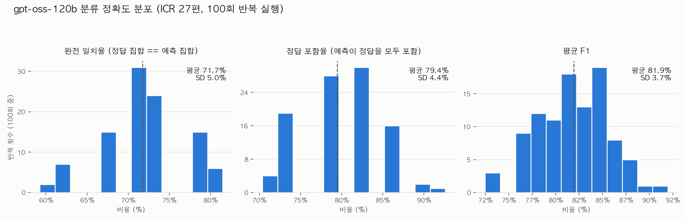
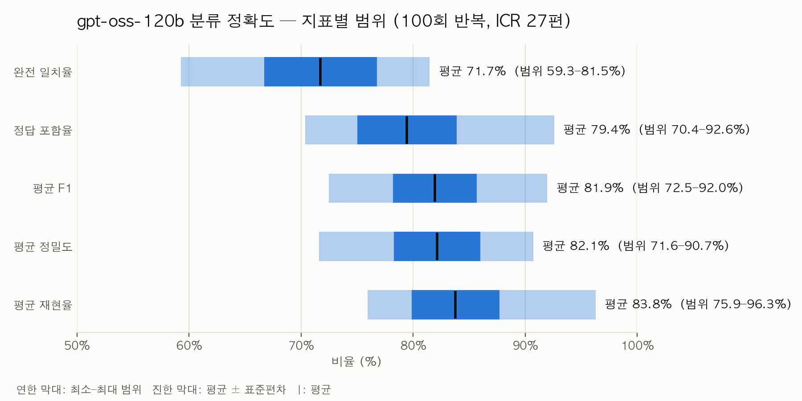

# 100회 반복 실행에서 지속적으로 틀리는 논문 분석

ICR 27편(일반 논문 19편 + ERR 테스트 8편)을 100회 반복 실행한 결과, 7편이 완전일치율 40% 미만으로 나타났다. 이 문서는 그 7편의 논문 정보, golden(정답) 라벨, 모델이 실제로 반복 실행에서 낸 annotation(예측) 분포, 그리고 실패 유형을 정리한다.

---

## 전체 정확도 개요 (100회 반복)

### 지표별 분포

100회 반복 각각의 완전일치율·정답포함율·평균F1을 히스토그램으로 나타낸 것이다. 점선은 100회 평균을 표시한다. 세 지표 모두 단일 값이 아니라 넓게 퍼진 분포를 이루는데, 이는 동일한 프롬프트·동일한 논문을 100번 반복해도 매번 결과가 달라지는 이 모델(gpt-oss-120b, temperature=0)의 실행별 변동성을 보여준다. 완전일치율은 60%대와 70%대 초반에 몰려있는 두 개의 봉우리(bimodal) 형태를 보이는데, 이는 아래에서 다룰 "지속적으로 틀리는 7편"이 반복마다 몇 편이 우연히 맞고 몇 편이 틀리는지에 따라 전체 결과가 계단식으로 움직이기 때문으로 보인다.

### 지표별 범위 요약

같은 100회 데이터를 지표 5개(완전일치율·정답포함율·평균F1·평균정밀도·평균재현율)의 범위로 압축한 것이다. 연한 막대는 100회 중 관측된 최소~최대 범위, 진한 막대는 평균±표준편차 구간, 검은 세로선(│)은 평균값이다. 완전일치율의 범위(59.3~81.5%)가 가장 넓어 변동성이 가장 크고, 재현율(75.9~96.3%)이 가장 안정적이다 — 즉 이 모델은 "정답을 놓치는 것"보다 "정답 외에 여분 코드를 덤으로 붙이는 것" 쪽에서 더 일관성이 없다는 뜻이다(정답 포함율·재현율은 비교적 안정적인데 완전일치율만 크게 흔들리는 것이 그 증거).

이 두 차트는 "평균적으로 얼마나 정확한가"를 보여주고, 아래 절들은 "그 평균을 갉아먹는 것이 구체적으로 어떤 논문·어떤 실패 패턴인가"를 다룬다.

---

## id 6 — 완전일치 0% (100회 중 0회)

**제목**: 게시글의 높은 추천 수는 커뮤니티 내 여론을 의미하는가?: 에펨코리아(FMkorea)의 게시글에 참여한 이용자 다양성과 추천 수의 관계
**저자/연도/학술지**: 문기홍, 2025, 한국사회학

**초록**: 온라인 커뮤니티에서 게시글이나 댓글에 대한 추천·비추천 투표 체계는 사용자 다수의 판단을 가시화하는 핵심적인 여론 형성 메커니즘이다. 그러나 많은 추천을 받은 게시글이 과연 커뮤니티 내 다양한 사용자 집단의 의견을 포괄적으로 대변하는지에 대해서는 충분히 검증되지 않았다. 이 연구는 온라인 커뮤니티 댓글을 통해 논의에 참여하는 사용자 집단의 다양성과 게시글의 추천 수 사이의 관계에 주목함으로써, 다양한 사용자 집단의 균등하고 풍부한 참여가 커뮤니티 내 주요 의제 형성에 미치는 영향을 체계적으로 탐색하였다. 이를 위해 한국의 온라인 커뮤니티 '에펨코리아(FMkorea)'의 유머 게시판에 작성된 게시글과 댓글을 자연어 처리(Natural Language Processing)를 활용하여 분석하였다. 분석 결과, 작성된 댓글을 기반으로 주요 관심 분야 및 커뮤니티 내 영향력의 측면에서 서로 구분되는 6개의 정체성 집단을 식별하였다. 또한 각 사용자 집단이 하나의 게시글 내에서 균등하게 논의에 참가하거나 특정 집단의 견해가 배척되지 않을수록, 그리고 댓글 간 상호작용을 통해 이루어지는 논쟁을 주도할수록 해당 게시글의 추천 투표수가 증가하였다. 균등한 논의 참가가 추천 투표수에 미치는 효과는 비적대적인 정치 참여 주제에서만 유의미한 반면, 다양한 집단의 견해가 균등하게 존중받거나 논쟁을 주도하는 경우에는 논의 주제와 상관없이 추천 투표수가 증가하였다. 분석 결과를 바탕으로 온라인 커뮤니티의 추천 체계가 커뮤니티 내 포괄적 여론 형성에 미치는 영향과 공론장으로서 온라인 커뮤니티가 갖는 잠재력 및 한계에 대해 논의하였다.

**Golden**: `ENV_COMMUNITY_GOVERNANCE`, `ROLE_FIELD_PUBLICSPHERE`

**실제 annotation 분포 (100회)**:
- `ROLE_FIELD_PUBLICSPHERE` 단독 — 97회
- `ROLE_FIELD_PUBLICSPHERE, ROLE_FIELD_SOCIALCAPITAL` — 3회

**실패 유형**: **다중 코드 중 2번째 코드 완전 누락형.** PUBLICSPHERE는 100번 중 100번 다 맞히지만, `ENV_COMMUNITY_GOVERNANCE`(추천/비추천 투표 체계라는 거버넌스 메커니즘)는 단 한 번도 잡지 못했다. 초록에 "추천·비추천 투표 체계"라는 거버넌스 관련 표현이 명확히 있는데도, 모델이 이를 ENV 축 코드로 연결짓지 못하는 것으로 보인다.

---

## id 8 — 완전일치 0% (정답 포함율 19%)

**제목**: 미술계 온라인 커뮤니티 연구: "네오룩 아카이브(2000-2024)"의 텍스트마이닝 분석
**저자/연도/학술지**: 배홍철, 2025, 문화와 사회

**초록**: 본 연구는 미술계 온라인 커뮤니티 "네오룩(Neolook)"의 아카이브 52,111건(2000-2024년)을 토픽 모델링 방법으로 분석하여 동시대 미술계의 지형을 탐색하였다. 기존 미술계 논의가 대형 전시와 저명 작가에 무게를 두었다면, 본 연구는 온라인 커뮤니티에서 일어나는 동시다발적인 움직임을 조명하였다. 잠재 디리클레 할당 모형(LDA)을 적용하여 22개의 토픽을 도출하였고, 전시의 형식과 주제, 그리고 미술계의 지형을 살펴보았다. 분석 결과, 회화 장르의 확장과 사진의 약세를 확인하였다. 주제의 측면에서는 사회적 의제가 감소하는 대신 개인의 서사는 확대되는 양상을 발견하였다. 그리고 미술계 커뮤니티가 대학생, 작가, 관객, 업계 실무자 등 다양한 주체들이 교차하는 공론장이자 협력망의 역할을 해왔다는 점을 알 수 있었다. 위 결과를 토대로 본 연구는 후속 작업과 대안적 방법론을 제안하면서 미술계 연구의 확장 가능성을 모색하였다.

**Golden**: `ROLE_WINDOW_MISC`

**실제 annotation 분포 (100회)**:
- `ROLE_FIELD_PUBLICSPHERE, ROLE_FIELD_SOCIALCAPITAL` — 52회
- `ROLE_FIELD_PUBLICSPHERE` 단독 — 29회
- `ROLE_FIELD_PUBLICSPHERE, ROLE_WINDOW_MISC` — 19회

**실패 유형**: **FIELD(PUBLICSPHERE/SOCIALCAPITAL) 과대표집형.** 100회 중 81회가 순수 FIELD 계열로만 나오고, MISC는 19회만 (그나마도 PUBLICSPHERE와 함께). 초록 마지막 문장 "공론장이자 협력망의 역할을 해왔다"는 표현이 PUBLICSPHERE/SOCIALCAPITAL의 정의 어휘와 표면적으로 정확히 겹쳐서, 이 논문의 실제 초점(미술계라는 외부 현상을 온라인 커뮤니티 데이터로 관찰하는 WINDOW_MISC)을 밀어내는 것으로 보인다.

---

## id 27 — 완전일치 6%

**제목**: 사용자간 상호작용성(User-to-User Interactivity)의 측정을 위한 척도 개발과 검증: 온라인 브랜드 커뮤니티를 대상으로
**저자/연도/학술지**: 황장선(중앙대학교), 2011, 광고학연구

**초록**: 본 연구의 목적은 디지털 컨버전스 현상으로 출현한 뉴미디어의 특성들 중 가장 핵심적인 개념이라고 할 수 있는 상호작용성의 여러 가지 유형 중 '사용자간 상호작용성(User-to-User Interactivity)'의 측정을 위한 척도를 개발하고 검증하는 데에 있다. 기존의 사용자-컨텐츠 간의 상호작용성을 측정하는 척도와 쇼핑몰에서의 사용자간 상호작용성을 측정하는 척도 등이 개발된 바 있지만, 이는 사용자간 상호작용성이 갖고 있는 여러 개념들을 포괄하기에는 무리가 있다. 이에 본 연구는 척도 개발의 과정을 거쳐 사용자간 상호작용성을 측정하는 4개 요인들과 세부 항목을 도출하였다. 각 요인은 '참여,' '공유,' '관계,' '반응' 등이며, 모두 14개 항목으로 최종 확정되었다. 이들의 신뢰도와 타당도는 모델 적합도 등의 지표로 검증한 바 높은 수준으로 나타났으며, 커뮤니티 효과 연구에서 가장 대표적으로 포함되는 결과변인인 커뮤니티 태도에 대한 예측력 또한 높은 수준으로 나타났다. 본 연구에서 개발된 사용자간 상호작용성 척도는 커뮤니티 및 관련 현상의 보다 체계적이고 정확한 측정을 가능하게 하여 해당 분야의 연구에 도움을 줄 것으로 기대한다.

**Golden**: `ROLE_FIELD_SOCIALCAPITAL`

**실제 annotation 분포 (100회)**:
- **빈 예측(11개 코드 전부 미부여, 사실상 ERR)** — 94회
- `ROLE_FIELD_SOCIALCAPITAL` — 6회

**실패 유형**: **빈 예측 붕괴형(신규 패턴).** SOCIALCAPITAL/MISC 사이에서 헷갈리는 게 아니라, 94%의 확률로 **아무 코드도 부여하지 못하고 사실상 ERR 상태로 붕괴**한다. 이 논문은 척도 개발·검증(방법론 논문)이라 "관계·공유·반응" 같은 SOCIALCAPITAL스러운 단어가 있어도, 실제 대상이 온라인 커뮤니티 자체의 현상이 아니라 측정도구 자체이다 보니 모델이 근거 문장을 찾지 못하는 것으로 보인다. id29와 같은 유형.

---

## id 13 — 완전일치 15%

**제목**: 메갈리아의 두 딸들: 익명성 수준에 따른 온라인 커뮤니티의 정체성 분화
**저자/연도/학술지**: 송준모·강정한, 2018, 한국사회학

**초록**: 전투적 여성주의를 표방한 온라인 커뮤니티 메갈리아의 정체성에 대해 온라인 여성주의에서부터 혐오사이트에 이르기까지 다양한 해석이 존재한다. 본 연구는 익명상황에서 형성되는 사회적 정체성의 분화에 주목하여 상이한 해석이 도출된 원인을 탐색한다. 글쓴이 ID 공개 여부로 구분되는 익명성 수준(완전익명, 부분익명)에 따라 게시물에 나타난 담론 내용의 차이를 파악하고 내부 갈등의 전개 양상을 재구성하기 위해 2015년에서 2016년에 이르는 메갈리아의 생애에 걸친 전체 게시물 162,893건을 분석하였다. 자연어처리 기법(토픽모델링, Word2Vec)을 활용한 분석결과에 따르면 전체 게시물에서 성차별과 연관있는 주제의 비중이 높았으며, 내부 갈등과 연관된 주제의 비중은 크지 않았다. 한편 완전익명 게시물에서는 메갈리아 방언을 이용한 분노 표출 토픽들이 배타적인 선호를 보였으며, 부분익명 게시물에서는 성차별 반대 캠페인 관련 토픽들이 배타적 선호를 보였다. 이러한 담론의 분화는 게시물의 대다수를 차지하는 완전익명 게시글에 주목하느냐, 혹은 주요 글쓴이에 주목하며 부분익명 게시글의 흐름을 파악하느냐에 따라 메갈리아의 정체성을 전혀 다르게 파악하게 한다. 더불어 익명성 수준에 상관없이 공유되는 주제 내에서도 정체성 간 사용하는 단어가 배타적으로 나뉘거나 공유단어의 활용맥락이 달라지는 방식으로 갈등이 발전한다. 두 가지 방식이 모두 관찰된 성소수자 논쟁의 경우 구성원의 대거 이탈과 커뮤니티의 쇠락을 야기했다. 이러한 연구결과를 통해 온라인 커뮤니티에서 사용자들이 익명성 수준과 같은 구조적 여건에 반응하여 정체성을 형성하고 상호작용하는 방식과, 커뮤니티의 생애과정 전개를 통합적으로 이해하는 분석틀의 발전에 기여하길 기대한다.

**Golden**: `ENV_COMMUNITY_LIFECYCLE`, `ENV_ONLINE_ANNONIMITY`

**실제 annotation 분포 (100회)**:
- `ENV_ONLINE_ANNONIMITY, ROLE_WINDOW_GENDER` — 74회
- `ENV_COMMUNITY_LIFECYCLE, ENV_ONLINE_ANNONIMITY` — 15회
- `ENV_ONLINE_ANNONIMITY` 단독 — 11회

**실패 유형**: **표면적 소재에 의한 대체형.** ANNONIMITY는 안정적으로 잡지만, 74%의 확률로 `ENV_COMMUNITY_LIFECYCLE`(성소수자 논쟁 이후 "구성원 대거 이탈과 커뮤니티 쇠락") 대신 `ROLE_WINDOW_GENDER`를 선택한다. "메갈리아"·"성차별"이라는 이름값과 표면적 소재가 너무 강해서, 실제 분석 초점(익명성 수준별 담론 분화 + 커뮤니티의 흥망)보다 "이건 젠더 갈등 논문이다"라는 손쉬운 결론으로 쏠리는 것으로 보인다.

---

## id 5 — 완전일치 17% (정답 포함율 100%)

**제목**: 인터넷 커뮤니티 활동이 윤리적 소비 참여에 미치는 영향: 온라인 사회자본과 공감 경험의 역할을 중심으로
**저자/연도/학술지**: 김재우·조반석, 2017, 정보사회와 미디어

**초록**: 본 연구의 목적은 20대-30대 청년층의 인터넷 커뮤니티 이용이 어떤 경로들을 통해 윤리적 소비 의향에 영향을 미치는지 규명하는 것이다. 이를 위해 온라인 패널조사 전문 기관을 통해 자료를 수집하고 인과 모형에 대한 경로분석을 수행하였다. 분석 결과에 따르면, 인터넷 커뮤니티에서 더 적극적으로 자신을 표현하고 타인의 글에 반응할수록 온라인상의 결속적 사회자본과 교량적 사회자본에 대한 지각 수준이 모두 높아지며 온라인 공감 경험 역시 증가한다. 한편 공감적 관심과 정서적 반응에 미치는 온라인 상호작용의 효과는 두 유형의 사회자본 중에서 교량적 사회자본에 의해서만 매개된다. 온라인상에서 다양한 정보와 의견을 접하거나 다른 지역의 일들에 관심을 가질수록 공감 경험이 많아지며, 그 결과 윤리적 소비 참여 의도가 증진되는 경향이 발견되었다. 이와는 대조적으로 인터넷 커뮤니티가 제공하는 '우리'라는 결속감과 심리적 지지에 대한 지각은 공감 경험이나 참여 의도에 영향력을 발휘하지 못했다. 계획된 행동이론과 관련된 변인들 중에서는 과거 참여 경험과 행동의 실행 가능성에 대한 믿음의 효과가 특히 유의미하였다. 이상의 결과들은 구매‧불매운동과 착한 소비(공정무역‧친환경‧로컬상품 구입)에 대해서 교차 확인되었으며, 특히 후자의 소비 유형에서 공감 경험의 역할이 더 중요한 것으로 나타났다. 본 연구는 온라인을 통한 정보적‧감정적 교류와 인지적‧정서적 반응이 결합되어 타인 지향적 공감을 만들어낼 때 인터넷 커뮤니티가 청년 네티즌들의 시민적 참여를 촉진할 수 있는 공동체가 될 수 있음을 시사해준다.

**Golden**: `ROLE_FIELD_SOCIALCAPITAL`

**실제 annotation 분포 (100회)**:
- `ROLE_FIELD_SOCIALCAPITAL, ROLE_WINDOW_MISC` — 82회
- `ROLE_FIELD_SOCIALCAPITAL` 단독 — 17회
- `ROLE_FIELD_PUBLICSPHERE, ROLE_FIELD_SOCIALCAPITAL` — 1회

**실패 유형**: **양성 과다예측형(정답은 항상 포함).** SOCIALCAPITAL은 100번 다 맞히지만, 82%의 확률로 `ROLE_WINDOW_MISC`가 덤으로 붙는다. "윤리적 소비", "구매·불매운동" 같은 결과변인이 그 자체로 하나의 사회현상(소비문화)처럼 보여서 WINDOW_MISC 후보로 잘못 채택되는 것으로 보인다 — 실제로는 SOCIALCAPITAL이 그 소비행동에 미치는 영향을 보는 것이지, 소비문화 자체를 조명하는 논문이 아닌데도.

---

## id 29 — 완전일치 29%

**제목**: '엄마표 영어' 담론 분석: 토픽모델링과 감성분석의 적용
**저자/연도/학술지**: 정옥경(총신대학교), 2024, 한국유아교육연구

**초록**: 본 연구는 온라인 육아 커뮤니티 데이터를 이용하여 엄마표 영어 담론을 분석하기 위해 수행되었다. 엄마표 영어 담론의 주제를 분석하기 위해 LDA 알고리즘 기반의 토픽모델링 기법을 적용하였고, 감성분석을 위해 KoGPT2를 사용하였다. 토픽모델링 분석을 수행한 결과, 16개 토픽이 도출되었고, 이는 '엄마표 영어 관련 고민', '엄마의 영어공부 및 연대', '엄마표 영어 지도방법 및 효과', '엄마표 영어 교육자료'라는 네 가지 대주제로 유목화되었다. 감성분석 결과, 전반적 감성은 긍정 감성이 높은 경향을 보였다. 16개 토픽에 대한 감성분석 적용 결과, '엄마표 영어 교육방법 고민', '엄마표 영어 진행 고민', '엄마표 영어 시작방법 고민', '엄마표 영어 스터디 그룹 결성', '생활영어 프로젝트 연대 결성'에서 긍정 감성이 우세하게 나타났다. 반면에 '엄마표 영어와 다른 영어교육방법 간 선택 고민'과 '레벨테스트'에서는 부정 감성이 높은 경향을 보였다. 연구결과는 유아동 부모의 영어교육 지원에 필요한 학문적 논의를 확대하고 관련 교육정책 대안 마련에 필요한 기초자료를 제공할 수 있을 것이다.

**Golden**: `ROLE_WINDOW_MISC`

**실제 annotation 분포 (100회)**:
- **빈 예측(사실상 ERR)** — 52회
- `ROLE_WINDOW_MISC` — 29회
- `ROLE_FIELD_SOCIALCAPITAL` — 15회

**실패 유형**: **빈 예측 붕괴형 + FIELD 혼동 혼재.** id27과 같은 "붕괴" 패턴이 절반 이상을 차지하면서, 나머지도 SOCIALCAPITAL(15%)로 새는 등 정답(MISC 29%)이 오히려 소수파다. "엄마의 영어공부 및 연대", "스터디 그룹 결성" 같은 표현이 SOCIALCAPITAL 어휘와 겹치는 한편, 육아 커뮤니티 담론이라는 소재 자체가 명확한 외부 사회현상(결혼·육아 문화)으로 잘 연결되지 못하는 것으로 보인다.

---

## id 12 — 완전일치 36%

**제목**: 네트워크 시대의 인터넷 정치참여: 탄핵정국 디시인사이드 정치토론 게시판을 중심으로
**저자/연도/학술지**: 송경재, 2005, 담론201

**초록**: 본 논문은 네트워크의 결집체로서 인터넷이 정치과정 특히 정치참여에 어떤 영향을 미치는지를 분석하고자 한다. 2004년 탄핵정국 동안 온라인과 오프라인에서의 활동으로 사회적 반향을 불러일으킨 인터넷 사이트 <디시인사이드>의 '정치토론 게시판'을 사례 연구하여 IT 기반 네트워크 시대의 정치참여가 가지는 함의와 정치참여 과정, 확산, 그리고 특성을 분석하고자 했다. 연구결과, 첫째, 탄핵정국 동안 디시의 정치토론 게시판은 '네트워크 정치참여(political participation of network)'라 불릴만한 참여방식을 형성했다. 그로인해 네티즌들의 정치참여 내용은 풍부화되고 유용성뿐만 아니라 커뮤니케이션을 통해 정치적 관심을 유지하는데 기여했다. 둘째, 네트워크형 정치참여는 정치참여의 활성화·주체의 보편화·방식의 다양화라는 새로운 참여를 가능케 하고 있다. 셋째, 정치참여 측면에서 인터넷 네트워크는 단순히 도구론적 이용이 아니라, 참여의 성격을 바꾸고 자발적인 참여를 촉진시키는데 긍정적인 기여를 할 수도 있다. 넷째, 사이버 공간에서 아주 작은 규모의 참여라도 개인에게 미치는 영향은 큰 효과를 발휘해 민주주의의 학습장으로 발전할 가능성을 발견했다. 이와 함께 네트워크로 인한 정치참여의 용이함은 반대로 책임 없는 참여로 나갈 수 있다는 것과 일상에서 참여의 강화 여부, 그리고 정보격차의 심화 등이 문제점으로 지적되어 네트워크 정치참여와 관련한 보다 많은 연구가 필요성도 확인되었다.

**Golden**: `ROLE_FIELD_PUBLICSPHERE`

**실제 annotation 분포 (100회)**:
- `ROLE_WINDOW_MISC` — 45회
- `ROLE_FIELD_PUBLICSPHERE` — 36회
- `ROLE_FIELD_PUBLICSPHERE, ROLE_WINDOW_MISC` — 13회

**실패 유형**: **FIELD/WINDOW 진짜 경계 사례형.** 세 방향으로 거의 고르게 흔들리는(45/36/13/나머지6) 유일한 사례. "정치참여"라는 소재가 그 자체로 WINDOW_MISC급 사회현상처럼 보이는 동시에, "네트워크 정치참여라는 새로운 참여방식을 형성했다"는 문장은 PUBLICSPHERE(공론장 기능 검증)로도 읽힌다. 다른 6편과 달리 이건 taxonomy 경계 자체가 애매한 경우로 보이며, 모델의 결함이라기보다 논문 자체의 이중적 성격에 가깝다.

---

## 요약

| id | 완전일치 | 핵심 실패 유형 |
|---|---|---|
| 6 | 0% | 2번째 코드(ENV_GOVERNANCE) 완전 누락 |
| 8 | 0% | FIELD 과대표집 (MISC를 밀어냄) |
| 27 | 6% | 빈 예측 붕괴 |
| 13 | 15% | 표면적 소재(젠더)에 의한 대체 |
| 5 | 17% (포함 100%) | 양성 과다예측 (MISC가 덤으로 붙음) |
| 29 | 29% | 빈 예측 붕괴 + FIELD 혼동 |
| 12 | 36% | 진짜 경계 사례 (3방향 분산) |

7편 중 4편(6, 8, 13, 29)이 사실상 예측 가능한 방향으로 **일관되게** 틀리고 있다는 점이 중요하다 — 무작위 노이즈가 아니라, 특정 표면적 어휘(연대, 공론장, 젠더 이름값 등)에 낚이는 구조적 패턴이다. id27·29의 "빈 예측 붕괴"는 이번에 새로 확인된 패턴으로, 별도의 원인 분석이 필요하다.
